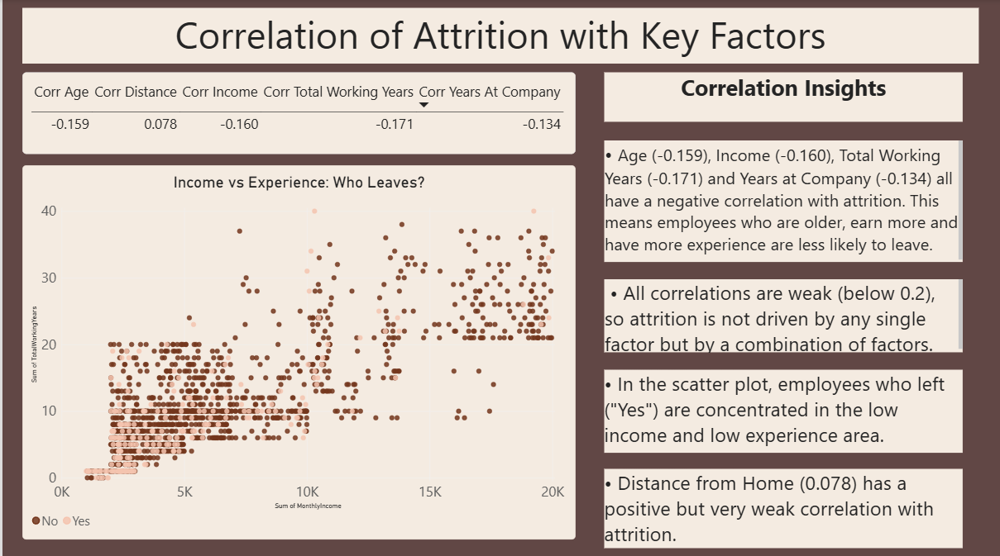

**HR Analytics Dashboard – Employee Attrition Analysis**

An interactive HR Analytics Dashboard built using Microsoft Power BI to analyze employee attrition, identify workforce trends, and understand the key factors associated with employee turnover.

Project Overview

Employee attrition can increase hiring costs and affect organizational productivity. This project analyzes an HR employee dataset to identify patterns in employee attrition and presents the findings through an interactive Power BI dashboard.

The dashboard explores attrition across departments, job roles, overtime, age, income, tenure, and other employee characteristics.

Objectives

* Analyze employee data such as salary, department, and experience.
* Identify patterns in employee attrition.
* Analyze factors associated with employee turnover.
* Compare attrition across departments and job roles.
* Calculate key HR KPIs such as attrition rate and retention rate.
* Build an interactive dashboard for HR analysis and decision-making.

Tools & Technologies

* Microsoft Power BI Desktop
* DAX
* Data Modelling
* Data Visualization
* Microsoft Excel / CSV

Dataset

The dataset contains "1,470 employee records" with attributes including:

* Age
* Gender
* Department
* Job Role
* Monthly Income
* Overtime
* Marital Status
* Total Working Years
* Years at Company
* Attrition

The `Attrition` field indicates whether an employee has left the organization (`Yes/No`).

Derived fields such as "Age Band, Income Band, and Tenure Band" were created for analysis.

Dataset: [WA_Fn-UseC_-HR-Employee-Attrition.csv](./WA_Fn-UseC_-HR-Employee-Attrition.csv)

Key Performance Indicators

| KPI             |  Value |
| --------------- | -----: |
| Total Employees |  1,470 |
| Attrition Count |    237 |
| Attrition Rate  | 16.12% |
| Retention Rate  | 83.88% |

 Dashboard Preview

1. Overview Dashboard

The Overview page provides a summary of the workforce, including:

* Total Employees
* Attrition Count
* Attrition Rate
* Retention Rate
* Department-wise attrition
* Job role-wise attrition
* Department and Gender filters
* Key insights and recommendations

### 2. Attrition Analysis

This page compares employee attrition across:

* Department
* Overtime
* Marital Status
* Age Band
* Job Role
* Income Band
* Tenure Band

### 3. Correlation Analysis

The Correlation page examines relationships between attrition and numerical factors such as:

* Age
* Distance from Home
* Monthly Income
* Total Working Years
* Years at Company

It also includes a scatter plot comparing Monthly Income and Total Working Years by attrition status.

 Key Findings

* The "Sales department" has the highest attrition rate at "20.63%".
* "Sales Representatives" show the highest attrition among job roles, at close to 40%.
* Employees working "OverTime" have a substantially higher attrition rate.
* The "18–25 age group" has the highest attrition.
* Attrition is highest in the "lowest income band" and decreases as income increases.
* Employees in their "first two years" at the company show the highest attrition.
* "Single employees" show higher attrition than married or divorced employees.
* Correlations with age, income, experience, and tenure are weak, suggesting that attrition is associated with a combination of factors rather than one single factor.

Recommendations

Based on the analysis:

* Reduce excessive overtime and monitor workload balance.
* Strengthen onboarding and mentoring programs for new employees.
* Review compensation, particularly for Sales roles and lower-income groups.
* Monitor employee groups showing higher attrition patterns.
* Consider multiple factors such as compensation, workload, career growth, and work environment when planning retention strategies.

Project Files

| File                                                                        | Description               |
| --------------------------------------------------------------------------- | ------------------------- |
| [HR Attrition Dashboard.pbix](./HR%20Attrition%20Dashboard.pbix)            | Power BI dashboard file   |
| [HR Analytics Dashboard Report](./HR_Analytics_Dashboard_Report.pdf)        | Detailed project report   |
| [HR Employee Attrition Dataset](./WA_Fn-UseC_-HR-Employee-Attrition.csv)    | Employee dataset          |
| [Overview Dashboard Image](./HR%20attrition.png)                            | Dashboard overview        |
| [Attrition Analysis Image](./attrition%20analysis.png)                      | Attrition analysis page   |
| [Correlation Analysis Image](./correlation.png)                             | Correlation analysis page |

Author
Rani Rai

Project: HR Analytics Dashboard – Employee Attrition Analysis
Platform: Microsoft Power BI
Project 3 | Syntecxhub
